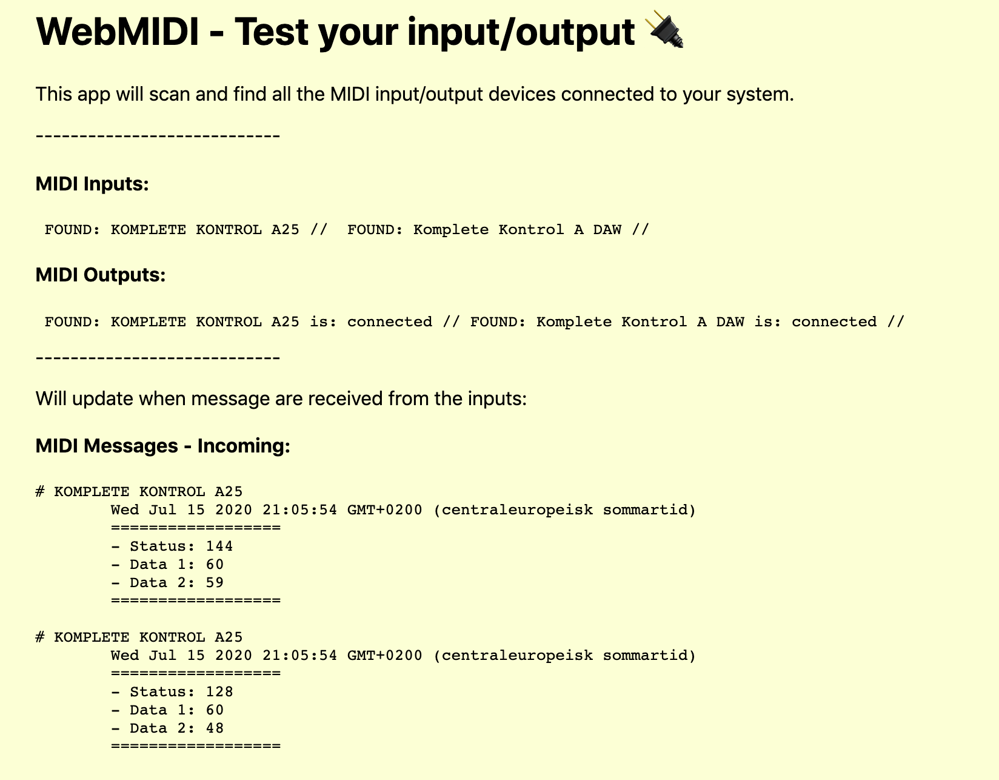

## App that scan and find all the MIDI input/output devices connected to your system.

* Check console for hardware and port info
* Will list MIDI in / out 
* Incoming MIDI data

#### Tech used: 
- JavaScript
- VS Code

## View it live - the website:
https://webmidi-io.netlify.app/

